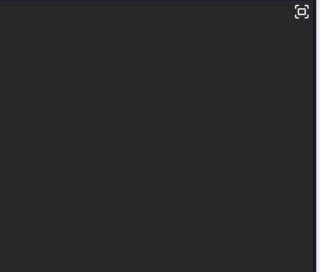

# Falling Ball Simulation Workshop

This is the public repository for The School of Computing Technologies workshop on introduction to Algorithmic Thinking and Coding.

This workshop teaches you how to code a simulator in Python that models how objects fall due to gravity.
You'll learn the basics of physics behind free fall (including position, velocity, and acceleration) and how to translate those concepts into code. The workshop will focus on simulating a ball falling and rebounding off the ground, taking into account gravity and energy loss with each bounce. By the end, you’ll have built a simple yet powerful simulation that brings these physical principles to life using Python! 🏀 ⚽

This workshop is based on the Scratch project [Falling Ball](https://scratch.mit.edu/projects/1106875189/) presented at [MAV Annual Conference 2022 and 2024](https://www.mav.vic.edu.au/Conference/Previous-Annual-Conferences).

This repository steps students through the project in a 1-day tutorial, beginning with starter code in [fall.py](fall.py).

- [Falling Ball Simulation Workshop](#falling-ball-simulation-workshop)
  - [Setup and Requirements](#setup-and-requirements)
  - [⚽ Part I: Tutorial Overview](#-part-i-tutorial-overview)
    - [1️⃣ Prepare your JuiceMind workspace and test run](#1️⃣-prepare-your-juicemind-workspace-and-test-run)
    - [2️⃣ Setup screen and draw a circle (the “ball”)](#2️⃣-setup-screen-and-draw-a-circle-the-ball)
      - [📖 The flip-book simulator...](#-the-flip-book-simulator)
    - [3️⃣ Let’s move the ball higher up!](#3️⃣-lets-move-the-ball-higher-up)
    - [4️⃣  Make the ball fall like magic](#4️⃣--make-the-ball-fall-like-magic)
    - [✅ Mission Complete!](#-mission-complete)
  - [🧱 Part 2: Add a Floor – Make the Ball Bounce!](#-part-2-add-a-floor--make-the-ball-bounce)
    - [1️⃣ Define the Floor](#1️⃣-define-the-floor)
    - [2️⃣ Draw the Floor](#2️⃣-draw-the-floor)
    - [3️⃣ Stop the Ball at the Floor](#3️⃣-stop-the-ball-at-the-floor)
    - [🎉 **You Did It!**](#-you-did-it)
  - [🍃 Part 3: Add Gravity – Make the Ball Fall Faster! Plan](#-part-3-add-gravity--make-the-ball-fall-faster-plan)
    - [1️⃣ Three concepts to know](#1️⃣-three-concepts-to-know)
    - [2️⃣ Make velocity variable](#2️⃣-make-velocity-variable)
    - [3️⃣ Define gravity](#3️⃣-define-gravity)
    - [4️⃣ Handle the floor collision](#4️⃣-handle-the-floor-collision)
    - [✅ Mission Complete!](#-mission-complete-1)
  - [🦘 Part 4: Make the Ball Bounce (and Feel Real!)](#-part-4-make-the-ball-bounce-and-feel-real)
    - [1️⃣ Simple bounce](#1️⃣-simple-bounce)
    - [2️⃣ Add energy loss (realistic bounce)](#2️⃣-add-energy-loss-realistic-bounce)
    - [3️⃣ ⚠️ Final tweak: Stop tiny velocities](#3️⃣-️-final-tweak-stop-tiny-velocities)
    - [✅ Mission Complete!](#-mission-complete-2)
  - [🎨 Part 5: Upgrade the visuals](#-part-5-upgrade-the-visuals)
    - [🎯 Load images](#-load-images)
    - [🎯 Draw images instead of shapes](#-draw-images-instead-of-shapes)
    - [🎯 Bouncing sound](#-bouncing-sound)
  - [CONTRIBUTORS](#contributors)

## Setup and Requirements

This tutorial requires the following software:

- Python 3.10+
- [pygame](https://www.pygame.org/wiki/about) library
- [VSCode](https://code.visualstudio.com/) as the IDE

The linked [Installation](INSTALL.md) instructions install these requirements for Windows and Mac.

## ⚽ Part I: Tutorial Overview

In this tutorial, we’ll use code to control what appears on the screen. Coding is how we give instructions to a computer using a programming language—in this case, Python.

Python is popular because it’s easy to read (its code looks a bit like plain English!) and very versatile. It’s used by companies like Google, Netflix, Spotify, and NASA, and across many fields including web development, data science, automation, scientific research, game design, and healthcare—for tasks such as predictive analytics and image analysis. It’s a great choice for beginners, while still being powerful enough for building complex projects. 👍

In this tutorial, we’ll **simulate a ball falling and bouncing off the ground** ⚽ 🔽. Along the way, you’ll learn how to position the ball, update its movement as it falls, and even add gravity so it loses energy with each bounce. Maths in action! ⚙️ 🔢🧮📐𝞹🧠 ⚙️

Your final project may look like this:


As you progress, you’ll explore **key programming concepts** such as sequential steps, variables, functions, loops, and if-statements. These are essential building blocks that can be used to create a wide range of exciting projects.

We’ll write **instructions using functions—named blocks** of code that perform specific tasks, like moving the ball or drawing on the screen. Many useful functions are already available in Python and its libraries. Functions can take inputs called variables, which are like labelled boxes that store information we can use or update.

Instead of writing everything from scratch, we can also use libraries, which are collections of code created by others that we can reuse in our own programs. One such library is Pygame, which makes it easy to draw graphics and build interactive projects like animations and simple games. 🎮

The tutorial is organised into 10 steps 🦶, with each step introducing a new idea and showing how code can be used to model motion and animate our virtual ball. To get started, we’ve provided an initial code template for you to work on. Let’s do it!

### 1️⃣ Prepare your JuiceMind workspace and test run

To improve legibility, setup your JuiceMind screen to show only the instructions (left) and the code (right):

Slide left the Lesson Plan on the left.

Slide right the “Your Progress” panel on the right.

Now, run the given template by clicking the blue PLAY button ⏯️ and see what happens... 👀

### 2️⃣ Setup screen and draw a circle (the “ball”)

Now let’s take a closer look at the starter code 👀 The first lines load and initialise Pygame library, and  create a clock to control how often the screen will update, in our case, 60 frames per second for a smooth animation. 📺

```python
import pygame  # Import the Pygame library for graphics and game development
pygame.init()  # Initialize all Pygame modules (required before using Pygame)

# Set up consistent frame rate to ensure smooth animation
clock = pygame.time.Clock()
FPS = 60  # Frames per second – how often the screen updates (60 is standard)
```

> [!NOTE]
> The symbol # marks the start of a comment. Comments are not executed by the computer—they are there to explain what the code does, making it easier to read and understand later (both for others and for your future self!). 👍 It’s a good habit to include comments in your code so it remains clear and easy to follow.
>
> FPS is a variable, a kind of “box” that can store a value, we can check its value and also replace its value. 👍 It is good habit to use names that tell us what kind of data the variable contains, in this case frames-per-second. When we know we will never change the value of the variable, we often write it in capital letters and we call it a  “constant”.

Next we need to create our **canvas screen** where things will be drawn. In Pygame (and most graphics libraries), the screen works like a piece of graph paper—a 2D Cartesian plane (maths in action!). We use `x` and `y` coordinates to describe positions, where each point is a pixel that can be coloured:

- The top-left corner is `(0, 0)` — see computers start with 0, not 1! 😯
- Moving right increases `x`; moving down increases `y`
- So `(100, 100)` means 101 pixels across and 101 pixels down (remember we start with 0!)

So, let us define two variables `WIDTH` and `HEIGHT` to store our desired size of the screen and create a display screen using Pygame:

```python
# Define screen dimensions
WIDTH = 1200   # Screen width in pixels
HEIGHT = 800   # Screen height in pixels

SCREEN = pygame.display.set_mode((WIDTH, HEIGHT)) # Create the display window

pygame.display.set_caption('Falling Ball Simulation') # Set window title
```

The variable SCREEN is the most important one here: it refers to the whole Pygame screen window and we will use it to draw things on it!

**Fill the blanks:** The coordinate for the bottom right pixel is [blank] and the coordinate for the middle of the screen is [blank] Remember our screen is of size (1200, 800) with (0,0) being the top-left corner.

Next, we define three variables that define the size of the ball we want to draw, and its initial location in the center of the screen:

```python
ball_radius = 50  # Radius of the ball in pixels
ball_x = WIDTH // 2  # Initial x position (centered horizontally)
ball_y = HEIGHT // 2  # Initial y position (centered vertically)
```

> [!NOTE]
> The operation // is called “integer division”: It divides two numbers and rounds the result down to the nearest whole number. So, 5.5 // 2 = 2

**Question:** What are `ball_radius`, `ball_x` and `ball_y`?

#### 📖 The flip-book simulator...

A simulation works like a “flip-book”: it displays many images one after another, very quickly. Each image represents a small step—for example, the ball moving just a tiny bit.

In practice, a simulation repeatedly goes through four phases:

1. Check if the user has closed the window. If so, stop the simulation.
2. Update the state of the simulation (e.g., move the ball).
3. Render the new picture in the screen.
4. Update the screen.

This cycle is implemented using a `while` loop, which keeps running as long as the simulation is active. We use a boolean true/false (maths again!) variable `simulation_running` to track this: it starts as `True` and is set to `False` only when the user closes the window.

Here’s what the simulation loop looks like:

```python
# Main game loop
simulation_running = True  # keep running?
while simulation_running:
    # 1. if window is closed; set simulation_running = False
    ...

    # 2. Physics simulation update: ball position, velocity, etc.
    ...

    # 3. Render/draw the stage: background, ball, etc
    ...

    # 4. Render/draw the stage: background, ball, etc
    pygame.display.update()
```

- Phase 1 is always the same in Pygame and is given.
- Phase 2 is the most interesting one, as it is  where the actual simulation of a ball falling is implemented.
- Phase 3 is where the rendering (drawing of the whole scene) of the new frame is done, based on all the updates of Phase 2. Here we can chose how to draw the ball, the background, etc!
- Phase 4 just tells pygame to update the whole rendered screen.

**Question:** which is the line of code that draws the background of the stage?

Let us look at the third phase in the simulation cycle. The initial code provided does two things:

1. Fill the screen with yellow color, to represent the background (line 46 on right).
2. Draw a circle in the middle of the screen to represent the ball (line 47 on right).

Both steps are changes to the simulation `SCREEN` variable that we created at the start.

The instruction `pygame.draw.circle` tells pygame to draw a circle with the following information:

- `SCREEN` is where the circle needs to be drawn, namely, in the window of the simulation.
- `blue` is the colour we want the ball to be inside.
- `(ball_x, ball_y)` gives the coordinate position of the center of the circle.
- `ball_radius` is the size of the ball.

In this case, pygame is the library, draw  is the module in the library, and circle is the function in the module that does the actual drawing (there is another function in the draw module called rect). All is provided by the library we imported at the top!  🙆‍♀️

> [!NOTE]
> Notice that some things are written in quotes, like "blue". These are called strings—pieces of data that represent text rather than numbers. If you just write blue without quotes, Python will treat it as a variable name instead! In programming, we use strings to store and work with words, sentences, or any other kind of text. You can also manipulate strings—combine them, extract parts, change letters, or check if certain words appear inside.

### 3️⃣ Let’s move the ball higher up!

**Step Time! Make it your own:**

1. **Pick your background and ball colors** for your simulation—anything you like!
   - 🖌️ Go wild. Most obvious colors work, but Pygame knows a ton more. Check them out [here](https://www.pygame.org/docs/ref/color_list.html).
2. **Raise the ball up** ⚽ 🔼 on the screen so it has room to fall.
   - Change the variable that holds the ball’s **y-coordinate**. Remember: `(0,0)` is the **top-left corner**, not the middle! Make sure the ball is fully visible—what number will you pick?

🚀 Now you’re in control. Go ahead and tweak things—experiment and see what happens! Maybe move the ball to a side?

### 4️⃣  Make the ball fall like magic

Time to **bring our ball to life**—let’s make it fall at a steady speed! 🔽

🚀 **Your mission:**

- Move the ball down some number of pixels every simulation step by changing the ball’s y coordinate
- Make sure it’s inside the simulation loop and before you draw the screen.

**Here’s the trick:** every time the simulation loops (60 times per second 😲), we **move the ball a little bit down**. Remember, in Pygame, the top of the screen is `y = 0`, and the further down you go, the bigger the `y` value.

So if you want the ball to fall **3 pixels per frame**, just do:

```python
ball_y = ball_y + 3
```

💡In programming, this is called an **assignment**. It basically says:

> "Take the current value of `ball_y`, add 3, and then save the result back into `ball_y`."

⚠️ **Heads up:** variables only hold one value at a time. Assign a new value, and the old one is gone—unless you save it somewhere else first:

```python
old_ball_y = ball_y  # save it for later
ball_y = ball_y + 3
```

Go ahead, implement the line of code that makes the ball fall, run it, and boom—the ball should start falling smoothly! 👏

### ✅ Mission Complete!

You have successfully made the ball fall at a constant speed! Here’s what you’ve learned so far: 🌟

- How to set up a simulation loop that updates and renders frames.
- How to use variables to store and update the ball’s position via assignment statements.
- How to use basic arithmetic to change the ball’s position over time.
- How to draw shapes and colors on the screen using Pygame.
- How to use comments to explain your code and make it easier to understand.

## 🧱 Part 2: Add a Floor – Make the Ball Bounce!

Whoa! Why does the ball just keep falling off the screen? 😱 What happens when `ball_y` goes past the bottom (`HEIGHT`, 800 in our case)?

Right now, nothing is stopping it—it just keeps going. Let’s fix that by **adding a floor** 🛑 so the ball can bounce or stop when it hits it.

### 1️⃣ Define the Floor

Somewhere before your simulation loop, add these variables to store useful information:

```python
FLOOR_HEIGHT = 100
FLOOR_Y = HEIGHT - FLOOR_HEIGHT
```

The first variable stores how tall you want the floor to be (100 pixels). With it, we can then calculate at what y-coordinate the floor at the bottom should start, which is stored in `FLOOR_Y` variable. Don’t forget to **add a comment** explaining your new constants—future-you will thank you! 😉

### 2️⃣ Draw the Floor

Just after we draw the background of the stage, draw a floor as a long rectangle using pygame `rect(..)` drawing function:

```python
pygame.draw.rect(SCREEN, "black", (0, FLOOR_Y, WIDTH, HEIGHT))
```

👉 This command **draws a rectangle on the screen**. In our case, it’s the **floor**. 🧱

What each part means:

- `pygame.draw.rect(...)` → tells Pygame to draw a rectangle
- `SCREEN` → where to draw it (our window)
- `"black"` → the color of the rectangle
- `(0, FLOOR_Y, WIDTH, HEIGHT)` → the top-left rectangle position `(0, FLOOR_Y)` and size `(WIDTH, HEIGHT)`

👀 You should now **see a black floor** at the bottom of the screen. Go ahead—run it and check it out!

💡 Try changing the color or height to see how it affects the floor!

### 3️⃣ Stop the Ball at the Floor

Uh-oh... the ball still goes **through the floor** 😕. Remember, for the computer, colors are just pixels. To make the ball stop, we need a **rule**:

> If the ball position goes beyond the floor, then set the ball exactly at the floor.

In code, we can tell the computer to execute a line only if a condition is true using `if` statements. After you update the balls’ position, you should check Only let the ball fall if it `hasn’t hit the floor yet`.

```python
if (<condition: ball beyond floor>):
    ball_y = <value to set the ball exactly at floor>
```

Try it! 🏀

_Does it look right?  What if we change say 14 pixels down every frame?_ If it doesn’t look exactly right, think carefully: 🤔

- What does `(ball_x, ball_y)` actually represent?
- Which part of the ball hits the floor first?
- How could you tweak the condition to make it land perfect on the floor top?

💡 You can “debug” your code by printing useful information in interesting places. For example:

```python
print("Ball y position:", ball_y)
```

### 🎉 **You Did It!**

👏 **Congratulations!** You’ve just built the core of a simulation. Here’s what you’ve learned so far:

- Set up your coding environment and run your simulation.
- Worked with coordinates on a Cartesian plane.
- Updated position using “velocity”.
- Used **if statements** to control behavior.
- Created a **simulation loop** with repetition.
- Applied **math and logic** to model motion.
- Added **collision detection** with the floor.

💡 Now you can **experiment**: try different ball sizes, speeds, colors, or even create your own floor designs. Make it yours!

## 🍃 Part 3: Add Gravity – Make the Ball Fall Faster! Plan

🚀 **Mission briefing:** So far, our ball just falls at a constant speed... but in real life, **gravity makes things speed up** as they fall. Let’s make our ball obey the laws of physics! 🌎💨

### 1️⃣ Three concepts to know

To simulate gravity, we need three things:

1. **Position:** where the ball is on the screen `(x, y)` - we have that already!
2. **Velocity:** how fast it’s moving vertically (pixels per frame)
3. **Acceleration:** how fast the velocity itself changes—this is **gravity**, making the ball speed up as it falls

### 2️⃣ Make velocity variable

Right now, the ball moves a fixed 3 pixels per frame. Let’s replace that with a **variable** so it can change over time (this is called “abstraction” in computational thinking: ideas or concepts instead of specific fixed values):

```python
ball_x = WIDTH // 2
ball_y = HEIGHT // 2
ball_velocity = 3   # start with default velocity
```

Next, update the ball’s position using this velocity rather than a fixed value as before.

```python
ball_y = ball_y + ball_velocity
```

### 3️⃣ Define gravity

Set a constant for gravity (how much the velocity increases each frame):

```python
GRAVITY = 2  # pixels per frame acceleration
```

Then, **apply gravity every frame** to increase the velocity of our ball:

```python
# apply gravity
ball_velocity = ball_velocity + GRAVITY
```

💡 Think carefully: this line should go before updating the ball’s position so the velocity affects this frame.

### 4️⃣ Handle the floor collision

In the previous step, you made sure the ball stops at the floor. However, the velocity is still being updated, which means the ball keeps “wanting” to fall.

🛠️ Your task now is to fix this.

- When the ball reaches the floor, its vertical velocity should no longer increase.
- Identify the part of your code that detects when the ball hits the floor.
- Inside that logic, update the ball’s velocity so that it stops moving vertically.

💡 **Hint:** The position `(ball_x, ball_y)` represents the **center** of the ball, so make sure your floor check correctly accounts for the ball’s radius.

### ✅ Mission Complete!

- Run your simulation and watch: the ball now falls faster and faster until it hits the floor 🏀
- You’ve just added gravity and acceleration to your simulation!

💡 **Bonus challenge:** try changing `GRAVITY` or the ball’s starting height—what happens if you make it really heavy or light? 🌟

## 🦘 Part 4: Make the Ball Bounce (and Feel Real!)

🚀 **Mission briefing:** Your ball hits the floor... and just stops 😅 Let’s fix that by making it **bounce**—and then make it realistic! 🏀

### 1️⃣ Simple bounce

👉 When the ball hits the floor, it shouldn’t stop—it should **go back up**. That means its velocity changes direction:

- Falling down → positive velocity
- Going up → negative velocity

💡 So instead of setting velocity to 0, _which assignment do we need to run?_

1. `ball_y = 0`
2. `ball_velocity = GRAVITY`
3. `ball_velocity = ball_velocity * -1`
4. `ball_velocity = -1`

🚀 Do the change in the right place and run it! Your ball should now bounce **forever** with the same height.

### 2️⃣ Add energy loss (realistic bounce)

In real life, each bounce loses energy ⚡ Let’s simulate that so the ball slowly comes to rest.

The idea is simple: after each bounce, we keep only **90% of the velocity**. For example, if the velocity becomes `-100` after bouncing, we reduce it to `-90` (meaning about 10% of the energy has been lost).

🤔 How do we implement this in our code?

1. Define energy loss `ENERGY_LOSS` variable (before the loop).
2. Reduce velocity after each bounce.

Now the ball will bounce **lower and lower** each time.

### 3️⃣ ⚠️ Final tweak: Stop tiny velocities

At some point the ball should just stay still in the ground and velocity then should just be 0 — the ball is still.

Check if this is happening by printing ball’s velocity every at the end of each simulation cycle and before rendering: 👀

```python
print("Ball velocity:", ball_velocity)
```

🤔Does it get to zero? _If not, why?_

🛠️ Fix it by stating that if the value of velocity if very tiny, less than 2 pixels for example, we just set it to zero. To handle + and - velocities, we use the concept of absolute value (maths in action, once again!):

```python
if abs(ball_velocity) < 2:  # adjust this value if needed
    ball_velocity = 0
```

### ✅ Mission Complete!

You now have a bouncing ball with realistic physics:

- Direction changes on impact.
- Energy loss over time.
- Eventually comes to rest.

💡 Try experimenting—what happens if you change `ENERGY_LOSS` and `GRAVITY`?  How would you make this simulation:



## 🎨 Part 5: Upgrade the visuals

🚀 **Mission briefing:** Your simulation works great... but let’s be honest—it still looks a bit basic 😅

Time to level up the visuals and make it look like a real game! 🎮

### 🎯 Load images

First, load the image files (already provided) into variables:

```python
# load assets
ball_img = pygame.image.load("ball-soccer.png")
back_img = pygame.image.load("court-02.png")
back_img = pygame.transform.scale(back_img, (WIDTH, HEIGHT))
```

Note how, after loading it, we scale the background image to the size of our screen (stored in variables `WIDTH` and `HEIGHT`)

### 🎯 Draw images instead of shapes

**Let’s start by replacing the circle with the ball image.** 🏀

When we were drawing a circle, we used `(ball_x, ball_y)` as the center of the ball. But images in Pygame are drawn differently—they use the top-left corner by default.

That can feel a bit strange for a round object like a ball, because we usually think about its position from the center, not the corner.

To fix this, we can tell Pygame to position the image using its **center** instead:

```python
ball_rect = ball_img.get_rect(center=(ball_x, ball_y))
SCREEN.blit(ball_img, ball_rect)
```

👉 What’s happening here?

- `get_rect(...)` creates a rectangle around the image.
- We set its center to `(ball_x, ball_y)`.
- Then we draw (“blit”) the image using that rectangle.

✅ This way, the ball behaves exactly like before—its position is still controlled by its **center**, which makes movement and bouncing much more natural.

⚠️ **Important:** We are still using the old radius of our circle, which may not reflect the true size of our ball images. This may break the way the ball hits the floor. 🛠️ Fix it by changing the radius to be half of the image width:

```python
ball_radius = ball_img.get_width() // 2  # ball radius based on image size
```

Let’s finish by **replacing the background color** with the image we saved in variable `back_img`.  We do this by “blitting” (drawing) it on the screen with the top-left corner being at `(0, 0)`.

```python
SCREEN.blit(back_img, (0, 0))
```

⚠️ **Important:** Drawing order matters!

- Draw the **background first**.
- Then draw the **ball on top**.

Otherwise, your ball might disappear behind the background 👀

Also, now that you have a proper background, you may need to tweak the floor so everything lines up nicely. 😉

✅ Run it—you now have a real-looking ball and court! 🏀

### 🎯 Bouncing sound

First, load the bouncing sound already provided to you by using pygame audio tool. Add this to the data of your ball before the simulation cycle:

```python
bounce_snd = pygame.mixer.Sound("bounce.wav")
```

Then, at the moment of bouncing, play it! 🎵

```python
bounce_snd.play()
```

⚠️ **Important:** does the sound keep playing once the ball is still on the ground? _Why?_

🛠️ One way to fix it:

1. Introduce a Boolean variable to track whether the ball is still moving:
2. Create a variable `ball_moving`
3. Set it to `True` before the simulation loop starts

Then:

1. Only update the ball’s position and velocity **IF it is moving**
2. Detect when the ball is:
   - touching the floor, and
   - has zero velocity

    → At that point, set `ball_moving` to `False`

💡 **Key idea:** You want the bounce (and sound) to happen **only at the moment of impact**, not continuously while the ball is resting on the ground.

## CONTRIBUTORS

- [Sebastian Sardina](https://github.com/ssardina) (contact: sebastian.sardina@rmit.edu.au)
- [Marcos Sardina](https://github.com/msardina)  - original Scratch project and first translation to Python
- [Timothy Wiley](https://github.com/timothy-wiley) - Unplugged activities and supporting slides
